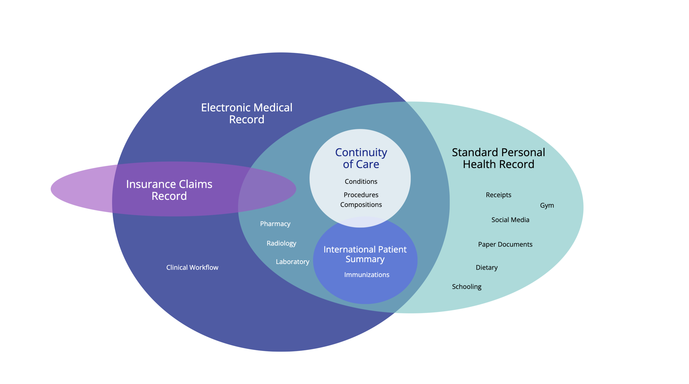

# Getting Started - Personal Health Records v1.0.0-ballot2

## Getting Started

The purpose of this implementation guide is to help the reader implement a Personal Health Record (in a programming language of their choice). The notion of a Personal Health Record (PHR) grows out of the concept of an Electronic Medical Record (EMR). The major difference being in ownership. The PHR being owned by the patient; and the EMR being owned by the hospital. Whereas an EMR is the digital chart maintained within a single organization, an Electronic Health Record (EHR) is the broader, interoperable longitudinal record shared across organizations; this guide uses the term EHR generically hereafter.

The following document will offer design guidance and standardized APIs for helping you develop your application; based on the healthcare industry standard of Fast Healthcare Interoperability Resources (FHIR). The scope of this document does not attempt to prescribe how you, the implementor, ought to go about programming your software. What it does provide, is guidance on how to successfully exchange data with other PHR and EHR apps. In effect, it documents widely supported (and government recognized) data standards and file formats for importing/exporting data into your software.

### What is a Personal Health Record?

Nearly two decades ago, the Markle Foundation's Personal Health workgroup convened to discuss the state-of-the-art in managing personal health information. The workgroup defined the PHR as "an electronic application through which individuals can access, manage and share their health information, and that of others for whom they are authorized, in a private, secure, and confidential environment." Their early vision was that PHRs would enable individuals to access and coordinate comprehensive, lifelong health information and exchange necessary parts of it.

The diagram above shows the intersection of the data collected by the patient, compared to the data collected by clinical EHRs or insurance systems. The core of the Personal Health Record should be medical grade, and able to incorporate records from any clinical source or setting; and which the patient can then carry from one healthcare provider to the next. This specification establishes standard mechanisms for a PHR to interoperate with other systems (clinical and otherwise), thereby facilitating sharing of information obtained by the PHR from healthcare encounters, personal documentation and measurement, and other sources.

For more details on functionality of a personal health record system, the reader is encouraged to review the [HL7 PHR System Functional Model](https://hl7.org/ehrs/uv/phrsfmr2/).

### Relevant Law

| | | | |
| :--- | :--- | :--- | :--- |
| **Netherlands** | MedMij Framework | Policy/Standard + Certification | Yes (HL7 FHIR) – MedMij defines FHIR-based APIs; all certified PHRs use these standard APIs. |
|   | PGO Personal Health Environments (apps) | Private PHR Platforms (gov’t backed) | Yes – Must be MedMij-certified; patients access data via DigiD login and FHIR APIs. |
| **Australia** | My Health Record (MyHR) | Government-run National PHR | Partial – Transitioning from CDA to FHIR-based APIs via FHIR Gateway for consumer access. |
|   | National Digital Health Strategy | Policy/Strategy | Yes – Emphasizes HL7 FHIR alignment; publishes FHIR implementation guides. |
| **Japan** | MynaPortal Health Access | Government portal & APIs | Yes – APIs link MynaPortal with private PHRs; using FHIR for new infrastructure. |
|   | Medical DX/Data Health Plans | National Policy | Yes – Standardizing EHR data and enabling patient access; includes SMART Health Cards (FHIR). |
|   | Personal Information Protection Commission | National Law | Not specifically. Only specifies handling of personal data and patient data ownership. |
|   | Act on the Protection of Personal Information | National Law | Not specifically. Only specifies handling of personal data and patient data ownership. |
| **United States** | 21st Century Cures Act & ONC/CMS Rules | Federal Laws/Regulations | Yes – Mandates HL7 FHIR APIs (US Core profiles); SMART on FHIR widely implemented. |
|   | Blue Button 2.0 / Apple Health Records | Government & Private Platforms | Yes – FHIR-based APIs for claims and provider data; app ecosystem supports FHIR APIs. |
| **Canada** | Connected Care Act (Bill C-72, 2024) | Proposed Federal Law | Yes (Planned) – Would mandate interoperable systems; aligns with Pan-Canadian FHIR specs. |
|   | Provincial Portals / Pan-Canadian FHIR Profiles | Patient portals / Standards | Partial – Web portals exist; FHIR-based standards in adoption phase. |
| **UK (England)** | NHS App & GP Record Access | NHS-operated Digital Services | Yes – NHS APIs (e.g., GP Connect) use FHIR; patients access data via NHS App. |
|   | CareConnect FHIR Profiles / Patients Know Best | National Profiles / Private PHR | Yes – Profiles define FHIR structures; private apps integrate via NHS APIs. |
| **Germany** | Patient Data Protection Act (PDSG) / ePA | National Law & PHR Platform | Partial – Currently uses CDA/IHE XDS; migrating to HL7 FHIR (ePA 2.0, Basisprofil DE). |
| **Finland** | Kanta PHR | Government PHR platform | Yes – Fully HL7 FHIR-based with open APIs; apps write to/read from PHR using Finnish FHIR profiles. |
| **Taiwan** | My Health Bank | National PHR Portal (NHI) | Partial – APIs/SDK provided; transitioning toward FHIR from legacy HL7 standards. |
| **India** | Ayushman Bharat Digital Mission (ABDM) | National Health IT Framework | Yes – HL7 FHIR adopted as primary exchange standard; personal consent-based PHR model. |

### How to Use This Implementation Guide

This Implementation Guide provides three main areas of guidance:

1. **File Formats**— The`.phr`and`.sphr`file extensions for portable personal health records (see[Record Keeping](recordkeeping.md))
1. **API Patterns**— Endpoints for importing and exporting health records (see[API Endpoints](api.md))
1. **Data Model**— Mapping PHR-S Functional Model requirements to FHIR resources (see[Data Model](datamodel.md))

The only portion of this guide required for conformance testing is the ability to import and export `.sphr` files. All other sections are informational and assist implementers in modeling patient health histories using FHIR.

### Use Cases

This guide is particularly interested in the problem of collecting and aggregating medical records from multiple healthcare systems and devices into a coherent whole. In the healthcare industry, these types of compiled records are known as `longitudinal` records. These needs arise in many situations: longitudinal health records and studies, snowbirds, symptom tracking, Long COVID, multiple chronic conditions, lifelogs, healthy living, differential diagnoses, alternative care, bring-your-own-device, the foster care system, migrants/immigrants, and climate refugees.

See the [Use Cases](usecases.md) page for detailed scenarios describing how a Personal Health Record supports each of these situations.

### Acknowledgements

* Jan Oldenburg, Patient Empowerment Workgroup
* Dr. Neelima Karipineni, MITRE
* Salim K Semy, MITRE
* Dave Carlson, Clinical Cloud Solutions
* Savannah Mueller, EMI Advisors

### References

* [Personal Health Record - System Functional Model](https://hl7.org/ehrs/uv/phrsfmr2/)
* [Personal Health Records Software for Consumers](https://www.medicalrecords.com/personal-health-records)
* [Best Electronic Health Records software of 2022](https://www.techradar.com/best/best-electronic-health-record-ehr-software)
* [Who Owns Medical Records: 50 State Comparison](http://www.healthinfolaw.org/comparative-analysis/who-owns-medical-records-50-state-comparison)
* [Centers for Medicare Services - PHR Pilots](https://www.cms.gov/Medicare/E-Health/PerHealthRecords/PHR_Pilots)
* [Implementing High Quality Primary Care](https://www.nationalacademies.org/our-work/implementing-high-quality-primary-care)
* [How to Export Facebook Data](https://blog.coupler.io/how-to-export-facebook-data/)
* [Human API - Getting Started](https://reference.humanapi.co/reference/getting-started)
* [Summary of Responses to an Industry RFI Regarding a Role for CMS with Personal Health Records](https://www.cms.gov/Medicare/E-Health/PerHealthRecords/Downloads/SummaryofPersonalHealthRecord.pdf)
* [HealthKit on FHIR](https://github.com/StanfordBDHG/HealthKitOnFHIR)

### License

Copyright (c) 2021+ Health Level Seven International and MITRE.org. 
 Published under the Creative Commons "Attribution 4.0 International" (CC BY 4.0) License

#### Dependencies

#### Globals

*There are no Global profiles defined*

#### Cross Version Analysis

This is an R4 IG. None of the features it uses are changed in R4B, so it can be used as is with R4B systems. Packages for both [R4 (hl7.fhir.uv.phr.r4)](../package.r4.tgz) and [R4B (hl7.fhir.uv.phr.r4b)](../package.r4b.tgz) are available.

#### IP Statements

This publication includes IP covered under the following statements.

* The UCUM codes, UCUM table (regardless of format), and UCUM Specification are copyright 1999-2009, Regenstrief Institute, Inc. and the Unified Codes for Units of Measures (UCUM) Organization. All rights reserved. [https://ucum.org/trac/wiki/TermsOfUse](https://ucum.org/trac/wiki/TermsOfUse)

* [Unified Code for Units of Measure (UCUM)](http://terminology.hl7.org/5.0.0/CodeSystem-v3-ucum.html): [Observation/pghd-activity-activeEnergyBurned](Observation-pghd-activity-activeEnergyBurned.md), [Observation/pghd-activity-activeEnergyBurned-underwater-diving](Observation-pghd-activity-activeEnergyBurned-underwater-diving.md)...Show 45 more,[Observation/pghd-activity-activeEnergyBurned-walking](Observation-pghd-activity-activeEnergyBurned-walking.md),[Observation/pghd-activity-appleExerciseTime](Observation-pghd-activity-appleExerciseTime.md),[Observation/pghd-activity-appleMoveTime](Observation-pghd-activity-appleMoveTime.md),[Observation/pghd-activity-basalEnergyBurned](Observation-pghd-activity-basalEnergyBurned.md),[Observation/pghd-activity-cyclingCadence](Observation-pghd-activity-cyclingCadence.md),[Observation/pghd-activity-distanceWalkingRunning-walking](Observation-pghd-activity-distanceWalkingRunning-walking.md),[Observation/pghd-alchol-consumption-blood-alcohol-content](Observation-pghd-alchol-consumption-blood-alcohol-content.md),[Observation/pghd-blood-glucose-1](Observation-pghd-blood-glucose-1.md),[Observation/pghd-blood-glucose-2](Observation-pghd-blood-glucose-2.md),[Observation/pghd-bloodpressure](Observation-pghd-bloodpressure.md),[Observation/pghd-bmi](Observation-pghd-bmi.md),[Observation/pghd-bodyheight](Observation-pghd-bodyheight.md),[Observation/pghd-bodymeasurement-body-fat-percentage](Observation-pghd-bodymeasurement-body-fat-percentage.md),[Observation/pghd-bodytemperature](Observation-pghd-bodytemperature.md),[Observation/pghd-bodyweight](Observation-pghd-bodyweight.md),[Observation/pghd-diving-underwater-depthg](Observation-pghd-diving-underwater-depthg.md),[Observation/pghd-diving-water-temperature](Observation-pghd-diving-water-temperature.md),[Observation/pghd-hearing-environmental-audio-exposure](Observation-pghd-hearing-environmental-audio-exposure.md),[Observation/pghd-hearingSensitivity-1](Observation-pghd-hearingSensitivity-1.md),[Observation/pghd-hearingSensitivity-2](Observation-pghd-hearingSensitivity-2.md),[Observation/pghd-hearingSensitivity-3](Observation-pghd-hearingSensitivity-3.md),[Observation/pghd-hearingSensitivity-4](Observation-pghd-hearingSensitivity-4.md),[Observation/pghd-heartbeat](Observation-pghd-heartbeat.md),[Observation/pghd-heartrate](Observation-pghd-heartrate.md),[Observation/pghd-medication-adherence](Observation-pghd-medication-adherence.md),[Observation/pghd-mobility-stair-descent-speed](Observation-pghd-mobility-stair-descent-speed.md),[Observation/pghd-nutrition-dietary-carbohydrates](Observation-pghd-nutrition-dietary-carbohydrates.md),[Observation/pghd-nutrition-dietary-energy-consumed](Observation-pghd-nutrition-dietary-energy-consumed.md),[Observation/pghd-nutrition-dietary-fiber](Observation-pghd-nutrition-dietary-fiber.md),[Observation/pghd-nutrition-dietary-protein](Observation-pghd-nutrition-dietary-protein.md),[Observation/pghd-oxygenSaturation](Observation-pghd-oxygenSaturation.md),[Observation/pghd-respiratoryrate](Observation-pghd-respiratoryrate.md),[Observation/pghd-sleep-episode-1](Observation-pghd-sleep-episode-1.md),[Observation/pghd-sleep-episode-2](Observation-pghd-sleep-episode-2.md),[Observation/pghd-sleep-episode-core-sleep-1](Observation-pghd-sleep-episode-core-sleep-1.md),[Observation/pghd-sleep-episode-core-sleep-2](Observation-pghd-sleep-episode-core-sleep-2.md),[Observation/pghd-sleep-episode-deep-sleep-1](Observation-pghd-sleep-episode-deep-sleep-1.md),[Observation/pghd-sleep-episode-deep-sleep-2](Observation-pghd-sleep-episode-deep-sleep-2.md),[Observation/pghd-sleep-episode-latency-to-sleep-onset-1](Observation-pghd-sleep-episode-latency-to-sleep-onset-1.md),[Observation/pghd-sleep-episode-latency-to-sleep-onset-2](Observation-pghd-sleep-episode-latency-to-sleep-onset-2.md),[Observation/pghd-snore-index-1](Observation-pghd-snore-index-1.md),[Observation/pghd-snore-index-2](Observation-pghd-snore-index-2.md),[Observation/pghd-testresult-forced-vital-capacity](Observation-pghd-testresult-forced-vital-capacity.md),[Observation/pghd-vitalsigns-apple-sleeping-wrist-temperature](Observation-pghd-vitalsigns-apple-sleeping-wrist-temperature.md)and[ObservationPGHD](CodeSystem-observation-pghd-codes.md)

* This material contains content from [LOINC](http://loinc.org). LOINC is copyright © 1995-2020, Regenstrief Institute, Inc. and the Logical Observation Identifiers Names and Codes (LOINC) Committee and is available at no cost under the [license](http://loinc.org/license). LOINC® is a registered United States trademark of Regenstrief Institute, Inc.

* [LOINC](http://terminology.hl7.org/5.0.0/CodeSystem-v3-loinc.html): [GAD7](Questionnaire-gad7.md), [Observation/ScoredAssessmentGAD7Example](Observation-ScoredAssessmentGAD7Example.md)...Show 28 more,[Observation/ScoredAssessmentPHQ9Example](Observation-ScoredAssessmentPHQ9Example.md),[Observation/pghd-blood-glucose-1](Observation-pghd-blood-glucose-1.md),[Observation/pghd-blood-glucose-2](Observation-pghd-blood-glucose-2.md),[Observation/pghd-blood-glucose-3](Observation-pghd-blood-glucose-3.md),[Observation/pghd-bloodpressure](Observation-pghd-bloodpressure.md),[Observation/pghd-bmi](Observation-pghd-bmi.md),[Observation/pghd-bodyheight](Observation-pghd-bodyheight.md),[Observation/pghd-bodytemperature](Observation-pghd-bodytemperature.md),[Observation/pghd-bodyweight](Observation-pghd-bodyweight.md),[Observation/pghd-heartrate](Observation-pghd-heartrate.md),[Observation/pghd-oxygenSaturation](Observation-pghd-oxygenSaturation.md),[Observation/pghd-pregnancy-status](Observation-pghd-pregnancy-status.md),[Observation/pghd-respiratoryrate](Observation-pghd-respiratoryrate.md),[ObservationScoredAssessmentScore](ValueSet-observation-scored-assessment-score-codes.md),[PCDSleepObservationCode](ValueSet-pcd-sleep-observation-code.md),[PGHDBMI](StructureDefinition-pghd-bmi.md),[PGHDBloodPressure](StructureDefinition-pghd-bloodpressure.md),[PGHDBodyHeight](StructureDefinition-pghd-bodyheight.md),[PGHDBodyTemperature](StructureDefinition-pghd-bodytemperature.md),[PGHDBodyWeight](StructureDefinition-pghd-bodyweight.md),[PGHDHeartRate](StructureDefinition-pghd-heartrate.md),[PGHDObservationScoredAssessment](StructureDefinition-pghd-observation-scored-assessment.md),[PGHDOxygenSaturation](StructureDefinition-pghd-oxygenSaturation.md),[PGHDPregnancyStatus](StructureDefinition-pghd-pregnancy-status.md),[PGHDRespiratoryRate](StructureDefinition-pghd-respiratoryrate.md),[PHQ9](Questionnaire-phq9.md),[QuestionnaireResponse/gad7](QuestionnaireResponse-gad7.md)and[QuestionnaireResponse/phq9](QuestionnaireResponse-phq9.md)

* This material contains content that is copyright of SNOMED International. Implementers of these specifications must have the appropriate SNOMED CT Affiliate license - for more information contact [https://www.snomed.org/get-snomed](https://www.snomed.org/get-snomed) or [info@snomed.org](mailto:info@snomed.org).

* [SNOMED Clinical Terms&reg; (SNOMED CT&reg;)](http://hl7.org/fhir/R4/codesystem-snomedct.html): [Bundle/pdr-message](Bundle-pdr-message.md), [ObservationSymptomSNOMEDCT](ValueSet-observation-symptom-snomedct-codes.md), [PCDSleepObservationCode](ValueSet-pcd-sleep-observation-code.md), [PCDSleepStageValueCode](ValueSet-pcd-sleep-observation-value.md) and [PGHDSymptom](StructureDefinition-pghd-symptom.md)

* This material derives from the HL7 Terminology (THO). THO is copyright ©1989+ Health Level Seven International and is made available under the CC0 designation. For more licensing information see: [https://terminology.hl7.org/license.html](https://terminology.hl7.org/license.html)

* [DataAbsentReason](http://terminology.hl7.org/7.1.0/CodeSystem-data-absent-reason.html): [GAD7](Questionnaire-gad7.md), [Observation/StateOfMind2Example](Observation-StateOfMind2Example.md), [Observation/pghd-blood-glucose-3](Observation-pghd-blood-glucose-3.md), [Observation/pghd-heartbeat](Observation-pghd-heartbeat.md) and [PHQ9](Questionnaire-phq9.md)
* [Observation Category Codes](http://terminology.hl7.org/7.1.0/CodeSystem-observation-category.html): [Observation/ScoredAssessmentGAD7Example](Observation-ScoredAssessmentGAD7Example.md), [Observation/ScoredAssessmentPHQ9Example](Observation-ScoredAssessmentPHQ9Example.md)...Show 68 more,[Observation/StateOfMind2Example](Observation-StateOfMind2Example.md),[Observation/StateOfMindExample](Observation-StateOfMindExample.md),[Observation/pghd-activity-activeEnergyBurned](Observation-pghd-activity-activeEnergyBurned.md),[Observation/pghd-activity-activeEnergyBurned-underwater-diving](Observation-pghd-activity-activeEnergyBurned-underwater-diving.md),[Observation/pghd-activity-activeEnergyBurned-walking](Observation-pghd-activity-activeEnergyBurned-walking.md),[Observation/pghd-activity-appleExerciseTime](Observation-pghd-activity-appleExerciseTime.md),[Observation/pghd-activity-appleMoveTime](Observation-pghd-activity-appleMoveTime.md),[Observation/pghd-activity-appleStandHour](Observation-pghd-activity-appleStandHour.md),[Observation/pghd-activity-basalEnergyBurned](Observation-pghd-activity-basalEnergyBurned.md),[Observation/pghd-activity-cyclingCadence](Observation-pghd-activity-cyclingCadence.md),[Observation/pghd-activity-distanceWalkingRunning-walking](Observation-pghd-activity-distanceWalkingRunning-walking.md),[Observation/pghd-alchol-consumption-blood-alcohol-content](Observation-pghd-alchol-consumption-blood-alcohol-content.md),[Observation/pghd-alchol-use-number-of-alcoholic-beverages](Observation-pghd-alchol-use-number-of-alcoholic-beverages.md),[Observation/pghd-audiogram](Observation-pghd-audiogram.md),[Observation/pghd-blood-glucose-1](Observation-pghd-blood-glucose-1.md),[Observation/pghd-blood-glucose-2](Observation-pghd-blood-glucose-2.md),[Observation/pghd-blood-glucose-3](Observation-pghd-blood-glucose-3.md),[Observation/pghd-bloodpressure](Observation-pghd-bloodpressure.md),[Observation/pghd-bmi](Observation-pghd-bmi.md),[Observation/pghd-bodyheight](Observation-pghd-bodyheight.md),[Observation/pghd-bodymeasurement-body-fat-percentage](Observation-pghd-bodymeasurement-body-fat-percentage.md),[Observation/pghd-bodytemperature](Observation-pghd-bodytemperature.md),[Observation/pghd-bodyweight](Observation-pghd-bodyweight.md),[Observation/pghd-cardiac-function-lowHeart-rate-event](Observation-pghd-cardiac-function-lowHeart-rate-event.md),[Observation/pghd-diving-underwater-depthg](Observation-pghd-diving-underwater-depthg.md),[Observation/pghd-diving-water-temperature](Observation-pghd-diving-water-temperature.md),[Observation/pghd-food](Observation-pghd-food.md),[Observation/pghd-hearing-environmental-audio-exposure](Observation-pghd-hearing-environmental-audio-exposure.md),[Observation/pghd-hearingSensitivity-1](Observation-pghd-hearingSensitivity-1.md),[Observation/pghd-hearingSensitivity-2](Observation-pghd-hearingSensitivity-2.md),[Observation/pghd-hearingSensitivity-3](Observation-pghd-hearingSensitivity-3.md),[Observation/pghd-hearingSensitivity-4](Observation-pghd-hearingSensitivity-4.md),[Observation/pghd-heart-electrocardiogram](Observation-pghd-heart-electrocardiogram.md),[Observation/pghd-heartbeat](Observation-pghd-heartbeat.md),[Observation/pghd-heartrate](Observation-pghd-heartrate.md),[Observation/pghd-medication-adherence](Observation-pghd-medication-adherence.md),[Observation/pghd-mindfulness-mindful-session](Observation-pghd-mindfulness-mindful-session.md),[Observation/pghd-mobility-stair-descent-speed](Observation-pghd-mobility-stair-descent-speed.md),[Observation/pghd-nutrition-dietary-carbohydrates](Observation-pghd-nutrition-dietary-carbohydrates.md),[Observation/pghd-nutrition-dietary-energy-consumed](Observation-pghd-nutrition-dietary-energy-consumed.md),[Observation/pghd-nutrition-dietary-fiber](Observation-pghd-nutrition-dietary-fiber.md),[Observation/pghd-nutrition-dietary-protein](Observation-pghd-nutrition-dietary-protein.md),[Observation/pghd-oxygenSaturation](Observation-pghd-oxygenSaturation.md),[Observation/pghd-pregnancy-status](Observation-pghd-pregnancy-status.md),[Observation/pghd-reproductive-health-intermenstrual-bleeding](Observation-pghd-reproductive-health-intermenstrual-bleeding.md),[Observation/pghd-respiratoryrate](Observation-pghd-respiratoryrate.md),[Observation/pghd-selfcare-handwashingEvent](Observation-pghd-selfcare-handwashingEvent.md),[Observation/pghd-sleep-asleep-core](Observation-pghd-sleep-asleep-core.md),[Observation/pghd-sleep-episode-1](Observation-pghd-sleep-episode-1.md),[Observation/pghd-sleep-episode-2](Observation-pghd-sleep-episode-2.md),[Observation/pghd-sleep-episode-core-sleep-1](Observation-pghd-sleep-episode-core-sleep-1.md),[Observation/pghd-sleep-episode-core-sleep-2](Observation-pghd-sleep-episode-core-sleep-2.md),[Observation/pghd-sleep-episode-deep-sleep-1](Observation-pghd-sleep-episode-deep-sleep-1.md),[Observation/pghd-sleep-episode-deep-sleep-2](Observation-pghd-sleep-episode-deep-sleep-2.md),[Observation/pghd-sleep-episode-latency-to-sleep-onset-1](Observation-pghd-sleep-episode-latency-to-sleep-onset-1.md),[Observation/pghd-sleep-episode-latency-to-sleep-onset-2](Observation-pghd-sleep-episode-latency-to-sleep-onset-2.md),[Observation/pghd-snore-event-1](Observation-pghd-snore-event-1.md),[Observation/pghd-snore-event-2](Observation-pghd-snore-event-2.md),[Observation/pghd-snore-event-3](Observation-pghd-snore-event-3.md),[Observation/pghd-snore-index-1](Observation-pghd-snore-index-1.md),[Observation/pghd-snore-index-2](Observation-pghd-snore-index-2.md),[Observation/pghd-symptom-fever](Observation-pghd-symptom-fever.md),[Observation/pghd-testresult-forced-vital-capacity](Observation-pghd-testresult-forced-vital-capacity.md),[Observation/pghd-uvexposure](Observation-pghd-uvexposure.md),[Observation/pghd-vitalsigns-apple-sleeping-wrist-temperature](Observation-pghd-vitalsigns-apple-sleeping-wrist-temperature.md),[Observation/pghd-voltage-measurement](Observation-pghd-voltage-measurement.md),[Observation/pghd-workout-underwater-diving](Observation-pghd-workout-underwater-diving.md)and[Observation/pghd-workout-walking](Observation-pghd-workout-walking.md)
* [Observation Reference Range Meaning Codes](http://terminology.hl7.org/7.1.0/CodeSystem-referencerange-meaning.html): [Observation/pghd-blood-glucose-2](Observation-pghd-blood-glucose-2.md)
* [identifierType](http://terminology.hl7.org/7.1.0/CodeSystem-v2-0203.html): [Bundle/pdr-message](Bundle-pdr-message.md)
* [ActCode](http://terminology.hl7.org/7.1.0/CodeSystem-v3-ActCode.html): [Bundle/pdr-message](Bundle-pdr-message.md)
* [MaritalStatus](http://terminology.hl7.org/7.1.0/CodeSystem-v3-MaritalStatus.html): [Bundle/pdr-message](Bundle-pdr-message.md)
* [ObservationInterpretation](http://terminology.hl7.org/7.1.0/CodeSystem-v3-ObservationInterpretation.html): [Observation/pghd-blood-glucose-2](Observation-pghd-blood-glucose-2.md)

* Using RxNorm codes of type SAB=RXNORM as this specification describes does not require a UMLS license. Access to the full set of RxNorm definitions, and/or additional use of other RxNorm structures and information requires a UMLS license. The use of RxNorm in this specification is pursuant to HL7's status as a licensee of the NLM UMLS. HL7's license does not convey the right to use RxNorm to any users of this specification; implementers must acquire a license to use RxNorm in their own right.

* [RxNorm](http://terminology.hl7.org/5.0.0/CodeSystem-v3-rxNorm.html): [MedicationAdministration/pghd-medicationadministration-insulin-1](MedicationAdministration-pghd-medicationadministration-insulin-1.md)

