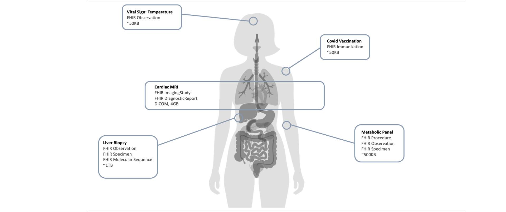

# Physiology Domains - Personal Health Records v1.0.0-ballot2

## Physiology Domains

Recurring challenges with designing PHR apps include figuring out which data to include (all of it? just the hospital data? fitness data?) and then finding suitable test data. This implementation guide does not purport to provide algorithms or workflows for every medical domain. However, we can reference the Synthea synthetic data generator, and recommend that PHR developers use it's algorithms for generating sample data for various medical conditions.



### Domain Analysis

The following table provides links to clinical workflow simulations, relevant terminologies, file types, estimated data usage, and diagnostic algorithms used in various medical domains that are typically incorporated into electronic medical records.

> Note: the following table provides approximate reference values for implementers. File sizes and frequencies will vary by institution and use case.

| | | | | | |
| :--- | :--- | :--- | :--- | :--- | :--- |
| Genomics | [Sequence Type](https://www.hl7.org/fhir/R4/valueset-sequence-type.html)[Human Chromosome](https://www.hl7.org/fhir/R4/valueset-chromosome-human.html) | FASTQ, BAM, VCFs | ~1TB | Annual/Lifetime | PharmacogenomicsPersonalized MedicineGenetic Risk Scoring |
| Radiology | [AcquisitionModality](https://dicom.nema.org/medical/dicom/current/output/chtml/part16/sect_CID_29.html)[Laterality](https://www.hl7.org/fhir/R4/valueset-bodysite-laterality.html)[SNOMED CT Body Structures](https://www.hl7.org/fhir/R4/valueset-body-site.html) | DICOM, JPG, PNG | ~1GB | Per Study | Surgical PlanningAutosegmentationLesion DetectionRadiation Therapy Planning |
| Embryology | [Embryonic Development Stages](https://www.ncbi.nlm.nih.gov/books/NBK10794/) | PDF, SVG | ~100KB | Periodic Checkups | Developmental Anomaly DetectionGenetic Screening |
| [Dermatology](https://github.com/synthetichealth/synthea/tree/master/src/main/resources/modules/dermatitis) | [SNOMED CT Skin Conditions](https://browser.ihtsdotools.org/) | JPG, PNG, DICOM | ~2MB | As Needed | Skin Lesion ClassificationMelanoma DetectionDermatitis Progression |
| [Endocrinology](https://github.com/synthetichealth/synthea/blob/master/src/main/resources/modules/hypothyroidism.json) | [Endocrine Disorder Codes](https://www.icd10data.com/ICD10CM/Codes/E00-E89) | PDF, CSV | ~100KB | Quarterly/Annually | Hormone Level AnalysisThyroid Function Evaluation |
| [Pediatrics](https://github.com/synthetichealth/synthea/blob/master/src/main/resources/cdc_growth_charts.json) | [Pediatric Growth Standards](https://www.cdc.gov/growthcharts/) | PDF, CSV | ~100KB | Periodic Checkups | Growth Trajectory MonitoringDevelopmental Milestone Tracking |
| [Metabolism & Biometrics](https://github.com/synthetichealth/synthea/blob/master/src/main/resources/biometrics.yml) | [HL7 Observation Codes](https://loinc.org/) | CSV, JSON | ~100KB | Daily/Weekly | Metabolic Rate CalculationBody Composition Analysis |
| [Neurology](https://github.com/synthetichealth/synthea/blob/master/src/main/resources/modules/epilepsy.json) | [Neurological Disorder Classifications](https://www.who.int/standards/classifications/classification-of-diseases/international-classification-of-diseases) | EEG, MRI, PDF | ~100KB | Periodic/As Needed | Seizure Pattern RecognitionNeuroplasticity Mapping |
| [Cardiology & Hemodynamics](https://github.com/synthetichealth/synthea/blob/master/src/main/resources/physiology/generators/circulation_hemodynamics.yml) | [Cardiac Condition Codes](https://www.icd10data.com/ICD10CM/Codes/I00-I99) | ECG, DICOM | ~5GB | Periodic/Continuous | Arrhythmia DetectionCardiovascular Risk Scoring |
| [Pulmonology](https://github.com/synthetichealth/synthea/blob/master/src/main/resources/modules/lung_cancer.json) | [Respiratory Disorder Codes](https://www.icd10data.com/ICD10CM/Codes/J00-J99) | X-Ray, CT, PDF | ~500MB | Periodic/As Needed | Lung Function AnalysisCancer Progression Tracking |
| Kinesthesiology | [Movement Disorder Codes](https://www.icd10data.com/ICD10CM/Codes/G00-G99) | Video, CSV | ~200MB | As Needed | Movement Pattern AnalysisRehabilitation Tracking |
| [Immunology](https://github.com/synthetichealth/synthea/blob/master/src/main/resources/immunization_schedule.json) | [Immunization Codes](https://www.cdc.gov/vaccines/schedules/) | PDF, CSV | ~100KB | Periodic | Immune Response ProfilingVaccination Efficacy |
| [Virology (COVID19)](https://github.com/synthetichealth/synthea/tree/master/src/main/resources/modules/covid19) | [COVID-19 Diagnostic Codes](https://www.cdc.gov/coronavirus/2019-ncov/) | PDF, CSV | ~20KB | Periodic/As Needed | Viral Load TrackingVariant Identification |
| Gastroenterology | [Digestive System Disorder Codes](https://www.icd10data.com/ICD10CM/Codes/K00-K95) | Endoscopy, MRI | ~4GB | As Needed | Inflammatory Marker AnalysisDigestive Function Evaluation |
| [Obstetrics](https://github.com/synthetichealth/synthea/blob/master/src/main/resources/modules/female_reproduction.json) | [Pregnancy Complication Codes](https://www.icd10data.com/ICD10CM/Codes/O00-O9A) | Ultrasound, PDF | ~100MB | Periodic | Fetal Development MonitoringHigh-Risk Pregnancy Identification |
| [Pregnancy](https://github.com/synthetichealth/synthea/blob/master/src/main/resources/modules/pregnancy.json) | [Maternal Health Codes](https://www.icd10data.com/ICD10CM/Codes/O00-O9A) | Ultrasound, PDF | ~100MB | Monthly/Trimesterly | Gestational Age TrackingPrenatal Health Assessment |
| Gynecology | [Reproductive Health Codes](https://www.icd10data.com/ICD10CM/Codes/N00-N99) | Ultrasound, PDF | ~200MB | Annual/As Needed | Reproductive Health ScreeningHormonal Balance Analysis |
| Andrology | [Male Reproductive Health Codes](https://www.icd10data.com/ICD10CM/Codes/N00-N99) | Semen Analysis, PDF | ~100MB | Annual/As Needed | Fertility AssessmentHormonal Profiling |
| [Urology](https://github.com/synthetichealth/synthea/blob/master/src/main/resources/modules/urinary_tract_infections.json) | [Urinary System Disorder Codes](https://www.icd10data.com/ICD10CM/Codes/N00-N99) | Ultrasound, CT | ~200MB | Periodic/As Needed | Kidney Function AnalysisUrinary Tract Infection Tracking |
| [Healthy Aging](https://github.com/synthetichealth/synthea/blob/master/src/main/resources/modules/wellness_encounters.json) | [Geriatric Assessment Codes](https://www.icd10data.com/ICD10CM/Codes/Z00-Z99) | PDF, CSV | ~100KB | Annual | Cognitive Function ScreeningLifestyle Risk Assessment |
| [Hospice Care](https://github.com/synthetichealth/synthea/blob/master/src/main/resources/modules/hospice_treatment.json) | [Palliative Care Codes](https://www.icd10data.com/ICD10CM/Codes/Z00-Z99) | PDF, Medical Records | ~200MB | Ongoing | Symptom ManagementQuality of Life Assessment |

### Synthetic Data Generator Installation

```
# download synthea
git clone https://github.com/synthetichealth/synthea

# go into the cloned directory
cd synthea

# build the app
./gradlew build check test

```

### References

[SyntheaTM Patient Generator](https://github.com/synthetichealth/synthea) 
 [Simulacres Et Simulation - Jean Baudrillard](https://doku.pub/download/simulacres-et-simulation-jean-baudrillard-1q7e2mp3ov0v)

